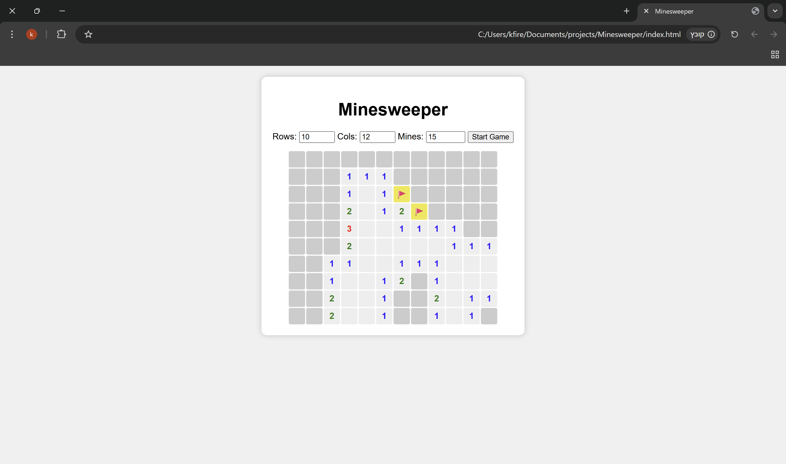

# Minesweeper Game

A simple web-based Minesweeper game built using HTML, CSS, and JavaScript.

## 🎮 Features

- Classic Minesweeper gameplay
- Left-click to reveal cells
- Right-click to flag mines

## 🛠 Technologies Used

- HTML
- CSS
- JavaScript

## 🚀 Getting Started

1. Clone the repository.
    ```bash
    https://github.com/Kfir15/Minesweeper
    ```
2. Open `index.html` in your browser.
3. Start playing!

## 📸 Preview



